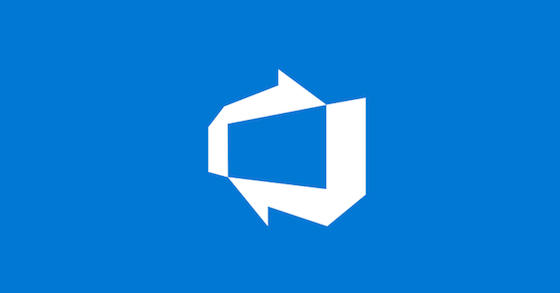

# Awesome Azure DevOps 🚀
 

The _Awesome Azure DevOps 🚀_ repository contains a list of awesome Azure DevOps content created by Microsoft and the community!

> Something about contributing here! :-)

  

## Table of Contents

- [Awesome Azure DevOps 🚀](#awesome-azure-devops-)
  - [Table of Contents](#table-of-contents)
  - [Microsoft content](#microsoft-content)
      - [Microsoft Learn](#microsoft-learn)
      - [Microsoft Videos](#microsoft-videos)
      - [Microsoft Blogs](#microsoft-blogs)
      - [Azure DevOps Tools and Extensions](#azure-devops-tools-and-extensions)
  - [Community content](#community-content)
      - [Community Videos](#community-videos)
      - [Community Blogs](#community-blogs)
      - [Community Podcasts](#community-podcasts)

## Microsoft content

> Content created by Microsoft

#### Microsoft Learn

[Back To Top](#Table-Of-Contents)

- [Get Started with Azure DevOps](https://learn.microsoft.com/en-us/training/paths/evolve-your-devops-practices/)
- [Build applications with Azure DevOps](https://learn.microsoft.com/en-us/training/paths/build-applications-with-azure-devops/)
- [Learning path Azure DevOps](https://learn.microsoft.com/en-us/training/browse/?expanded=azure&products=azure-devops)
- [What is Azure DevOps](https://learn.microsoft.com/en-us/azure/devops/user-guide/what-is-azure-devops?toc=%2Fazure%2Fdevops%2Fget-started%2Ftoc.json&view=azure-devops)

#### Microsoft Videos

[Back To Top](#Table-Of-Contents)

- [Azure DevOps: Zero to Hero](https://www.youtube.com/watch?v=DoWhZO7nbCY)
- [How to Deploy Power Platform with Azure DevOps](https://www.youtube.com/watch?v=iHpSuw8Ap48&t=758s)
- [Create Azure DevOps Management Reports](https://www.youtube.com/watch?v=gqUFAAByPfU)

#### Microsoft Blogs

[Back To Top](#Table-Of-Contents)

- [Microsoft Azure DevOps Official Blog](https://devblogs.microsoft.com/devops/)
- [Azure DevOps Roadmap](https://learn.microsoft.com/en-us/azure/devops/release-notes/features-timeline)
- [Azure DevOps What's New?](https://learn.microsoft.com/en-us/azure/devops/release-notes/docswhatsnew/)
- [DevOps Architecture Design](https://learn.microsoft.com/en-us/azure/architecture/guide/devops/devops-start-here)

#### Azure DevOps Tools and Extensions

[Back To Top](#Table-Of-Contents)

- [Get started with Azure DevOps CLI](https://learn.microsoft.com/en-us/azure/devops/cli/?view=azure-devops)
- [Azure DevOps Services REST API Reference](https://learn.microsoft.com/en-us/rest/api/azure/devops/?view=azure-devops-rest-7.1)
- [Azure DevOps Extensions](https://marketplace.visualstudio.com/azuredevops)

## Community content

> Content created by the community

#### Community Videos

[Back To Top](#Table-Of-Contents)

- [CI/CD with Azure Pipelines](https://www.youtube.com/watch?v=4BibQ69MD8c)
- [Getting Started with Azure DevOps Repos](https://www.youtube.com/watch?v=qLhVWJvox7g)

#### Community Blogs

[Back To Top](#Table-Of-Contents)

- [Bulk edit Azure DevOps work items using Excel](https://www.techielass.com/bulk-edit-azure-devops-work-items-using-excel/)
- [Parallel Jobs with automating testing](https://samlearnsazure.blog/2021/01/26/parallel-jobs-with-automating-testing/)
- [Parallel Azure Pipeline Jobs](https://samlearnsazure.blog/2020/02/11/parallel-azure-pipelines-jobs/)
- [Secret scanning in Azure DevOps with Defender for DevOps](https://johnlokerse.dev/2023/05/24/secret-scanning-in-azure-devops-with-defender-for-devops/)
- [Simplify Azure DevOps License Management with Group Rules](https://johnlokerse.dev/2023/04/15/simplify-azure-devops-license-management-with-group-rules/)
- [Protect Azure DevOps Personal Access Tokens with Conditional Access](https://johnlokerse.dev/2023/03/12/protect-azure-devops-personal-access-tokens-with-conditional-access/)
- [Azure Bicep validation in a pull request with Azure DevOps](https://johnlokerse.dev/2022/04/20/azure-bicep-validation-in-a-pull-request-with-azure-devops/)
- [Validating YAML using Azure DevOps or CLI](https://johnlokerse.dev/2022/02/07/validating-yaml-using-azure-devops-or-cli/)
- [I am in your pipeline reading all your secrets!](https://www.devjev.nl/posts/2022/i-am-in-your-pipeline-reading-all-your-secrets/)
- [Your service connection credentials are mine](https://www.devjev.nl/posts/2022/your-service-connection-credentials-are-mine/)

#### Community Podcasts

[Back To Top](#Table-Of-Contents)

- [Azure DevOps Podcast by Jeff Palermo](http://azuredevopspodcast.clear-measure.com/)